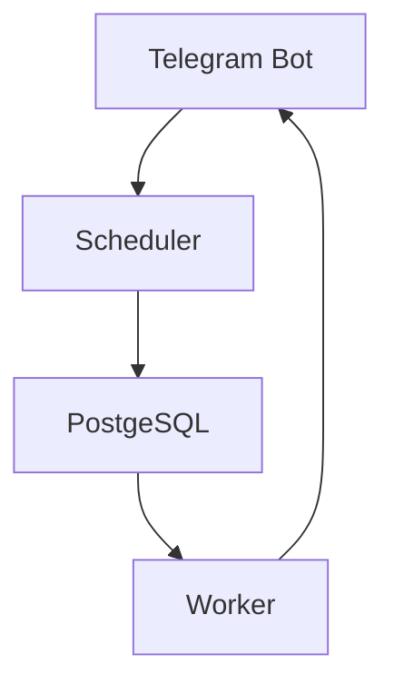

# Бот напоминалка
*Создавался для рабочих целей, но может быть подкорректирован под любые цели*


### Основные компоненты
- **Python-telegram-bot** - получает команды от пользователей
- **Scheduler** - планировщик задач (APScheduler)
- **PostgeSQL** - хранилище задач и состояний

### Схема взаимодействия


## Команды бота:
```
/start - Приветствие бота
/template - Шаблон для сообщения
/new_store - Сообщение для создания напоминания
```
## Основная информация по работе бота
**В боте работают 3 задания планировщика: Новые напоминания, Напоминания на которые не было реакции, Просроченные напоминания**

**Для создания нового напоминания отправляется текст написанный по шаблону на ```/new_store```, актуальный шаблон находится по команде ```/template```**

**Каждый день утром бот отправляет сообщения, если есть подходящие объекты**

*Время указано по МСК*

* 07:00 - Проверка просроченных уведомлений и перевод их в просроченные (сообщения ботом не отправляются)
* 09:20 - Повторное сообщение о напоминаниях на которые не было реакции (повторные сообщения будут отправляться каждый день пока на них не будет реакции или ```date_event``` не станет меньше ```now()```
* 09:30 - Новые напоминания

**Для реакции на новое напоминание необходимо ответить на сообщение напоминание с текстом "Подтверждено"**

**Для реакции на повторное напоминание необходимо перечислить ```sap_id``` магазинов которые приняты в работу "Подтверждено 1111 2222"**

**Время отправления сообщений могут быть скорректированы в ```setup_scheduler```**:
```
        scheduler = AsyncIOScheduler()
        scheduler.add_job(
            search_suitable_stores,
            CronTrigger(hour=9, minute=30),
            id="daily_check",
            timezone="Europe/Moscow",
            kwargs={"app": app}
        )
        scheduler.add_job(
            search_messages_without_response,
            CronTrigger(hour=9, minute=20),
            id="repeat_check",
            timezone="Europe/Moscow",
            kwargs={"app": app}
        )
        scheduler.add_job(
            messages_to_expired,
            CronTrigger(hour=7),
            id="expired",
            timezone="Europe/Moscow"
        )
```

**Новые напоминания отправляются за 5 дней до начала события ```date_event```**


## 📬 Контакты
[Telegram](https://t.me/Kalmar4uk) | [Issues](https://github.com/Kalmar4uk/bot_scheduler/issues)